# Azure Infrastructure Diagram — Sentinel Intelligence

> **Resource Group:** `ODL-GHAZ-2177134` · **Region:** Sweden Central  
> **Subscription:** `Sandbox AI DS - 1003462`  
> **Suffix:** `erzrpo` (derived from RG id)
>
> Legend: ✅ deployed · 🔜 planned · ❌ not started

```mermaid
flowchart TB
    subgraph ext["External / Mock Sources"]
        SCADA["SCADA / MES\n(simulated)"]
        REACT["React + Vite SPA\n🔜 swa-sentinel-intel-dev"]
    end

    subgraph ci["CI/CD · GitHub Actions"]
        GHA["deploy.yml\npush → main"]
    end

    subgraph rg["ODL-GHAZ-2177134 · Sweden Central"]

        subgraph ingestion["Ingestion Layer"]
            SB["✅ Service Bus\nsb-sentinel-intel-dev-erzrpo\nqueue: alert-queue"]
        end

        subgraph compute["Compute"]
            PLAN["✅ App Service Plan\nasp-func-sentinel-intel-dev-erzrpo · Y1 · Linux"]
            FUNC["✅ Azure Functions\nfunc-sentinel-intel-dev-erzrpo\nPython 3.11 · Consumption"]
        end

        subgraph agents["AI Agents · Azure AI Foundry"]
            FOUNDRY["🔜 AI Foundry Project\naoai-sentinel-intel-dev-erzrpo"]
            RA["🔜 Research Agent\nRAG + MCP-sentinel-db"]
            DA["🔜 Document Agent\ntemplates + confidence gate 0.7"]
            EA["🔜 Execution Agent\nMCP-qms + MCP-cmms"]
        end

        subgraph data["Data Layer"]
            subgraph cosmos["✅ Cosmos DB Serverless · cosmos-sentinel-intel-dev-erzrpo"]
                CDB_INC["incidents&#xa;/equipmentId"]
                CDB_EVT["incident_events&#xa;/incidentId"]
                CDB_NOTIF["notifications&#xa;/incidentId"]
                CDB_EQP["equipment&#xa;/id"]
                CDB_BAT["batches&#xa;/equipmentId"]
                CDB_CAPA["capa-plans&#xa;/incidentId"]
                CDB_APPR["approval-tasks&#xa;/incidentId"]
                CDB_TMPL["templates&#xa;/id"]
            end
            SEARCH["🔜 AI Search\nsrch-sentinel-intel-dev-erzrpo\n5 RAG indexes"]
            BLOB["✅ Storage Account\nstsentinelintelerzrpo\n5 blob containers for ingestion"]
        end

        subgraph realtime["Real-time"]
            SIGNALR["🔜 SignalR Service\nsigr-sentinel-intel-dev-erzrpo"]
        end

        subgraph security["Security"]
            KV["🔜 Key Vault\nkv-sentinel-intel-erzrpo"]
        end

        subgraph observability["Observability"]
            APPI["✅ Application Insights\nappi-sentinel-intel-dev-erzrpo"]
            LOG["✅ Log Analytics\nlog-sentinel-intel-dev-erzrpo · 30d"]
        end

    end

    %% CI/CD
    GHA -->|"bicep deploy + functions deploy"| rg

    %% External → Azure
    SCADA -->|"POST /api/alerts"| SB
    REACT -->|"REST + SignalR\nEntra ID token"| FUNC

    %% Ingestion → Compute
    SB -->|"ServiceBusTrigger"| FUNC
    PLAN --> FUNC

    %% Compute → Agents
    FUNC -->|"Durable: RunAgents activity"| FOUNDRY
    FOUNDRY --> RA & DA & EA

    %% Agents → Data
    RA -->|"search_incidents"| CDB_INC
    RA -->|"get_equipment"| CDB_EQP
    RA -->|"get_batch"| CDB_BAT
    RA -->|"vector search"| SEARCH
    DA -->|"write CAPA plan"| CDB_CAPA
    EA -->|"read CAPA"| CDB_CAPA
    EA -->|"create_audit_entry"| CDB_APPR

    %% Compute → Data
    FUNC -->|"CRUD"| CDB_INC
    FUNC -->|"audit + transcript"| CDB_EVT
    FUNC -->|"notify"| CDB_NOTIF
    FUNC -->|"read"| CDB_EQP
    FUNC -->|"read"| CDB_BAT
    FUNC -->|"write (notify)"| CDB_APPR
    FUNC -->|"blob trigger → chunk → embed"| BLOB
    BLOB -->|"index documents"| SEARCH

    %% Real-time
    FUNC -->|"NotifyOperator activity"| SIGNALR
    SIGNALR -->|"push: approval pending\nstatus change"| REACT

    %% Secrets
    FUNC -.->|"Managed Identity"| KV
    FOUNDRY -.->|"Managed Identity"| KV

    %% Observability
    FUNC -->|"traces · exceptions · metrics"| APPI
    APPI --> LOG
```

## Deployed resources

| Resource | Name | Status | Bicep module | Task |
|---|---|---|---|---|
| Storage Account | `stsentinelintelerzrpo` | ✅ | `modules/storage.bicep` | T-041 |
| Log Analytics | `log-sentinel-intel-dev-erzrpo` | ✅ | `modules/monitoring.bicep` | T-041 |
| Application Insights | `appi-sentinel-intel-dev-erzrpo` | ✅ | `modules/monitoring.bicep` | T-041 |
| Cosmos DB Serverless | `cosmos-sentinel-intel-dev-erzrpo` | ✅ | `modules/cosmos.bicep` | T-041 |
| Service Bus | `sb-sentinel-intel-dev-erzrpo` | ✅ | `modules/servicebus.bicep` | T-041 |
| App Service Plan | `asp-func-sentinel-intel-dev-erzrpo` | ✅ | `modules/functions.bicep` | T-041 |
| Azure Functions | `func-sentinel-intel-dev-erzrpo` | ✅ | `modules/functions.bicep` | T-041 |
| AI Search | `srch-sentinel-intel-dev-erzrpo` | 🔜 | `modules/search.bicep` | T-037 |
| SignalR Service | `sigr-sentinel-intel-dev-erzrpo` | 🔜 | `modules/signalr.bicep` | T-030 |
| Key Vault | `kv-sentinel-intel-erzrpo` | 🔜 | `modules/keyvault.bicep` | T-038 |
| Static Web App | `swa-sentinel-intel-dev` | 🔜 | `modules/swa.bicep` | T-032 |
| AI Foundry Project | `aoai-sentinel-intel-dev-erzrpo` | 🔜 | `modules/foundry.bicep` | T-025 |

## Cosmos DB containers (`sentinel-intelligence`)

| Container | Partition key | Status |
|---|---|---|
| `incidents` | `/equipmentId` | ✅ |
| `incident_events` | `/incidentId` | ✅ |
| `notifications` | `/incidentId` | ✅ |
| `equipment` | `/id` | ✅ |
| `batches` | `/equipmentId` | ✅ |
| `capa-plans` | `/incidentId` | ✅ |
| `approval-tasks` | `/incidentId` | ✅ |
| `templates` | `/id` | ✅ |

---

> **How to update:** when a new resource is added to `main.bicep`, change `🔜` → `✅` in the table and diagram above.
