# Azure Infrastructure Diagram — Sentinel Intelligence (Target Architecture)

> **Ресурсна група:** `ODL-GHAZ-2177134` · **Регіон:** Sweden Central · **Secondary DR:** North Europe  
> **Subscription:** `Sandbox AI DS - 1003462`  
> **Суфікс:** `erzrpo` (derived from RG id)
>
> Ця діаграма описує **цільову (production) інфраструктуру**. Скорочення, зроблені для хакатонного прототипу (відсутні VNet/PE, CA/PIM, multi-region DR, load testing тощо), перераховані у [../docs/hackathon-scope.md](../docs/hackathon-scope.md).

```mermaid
flowchart TB
    subgraph ext["External / Source Systems"]
        SCADA["SCADA / MES / IoT\nPOST /api/alerts"]
        REACT["React + Vite SPA\nswa-sentinel-intel-dev\nMSAL · role-based UI"]
    end

    subgraph ci["CI/CD · GitHub Actions"]
        GHA["ci.yml · deploy.yml · load-test.yml\nbicep what-if · Foundry eval gate"]
    end

    subgraph rg["ODL-GHAZ-2177134 · Sweden Central"]

        subgraph net["Network · VNet 10.0.0.0/16"]
            SNETF["snet-functions · 10.0.1.0/24\nVNet Integration"]
            SNETPE["snet-private-endpoints · 10.0.2.0/24\nPrivate DNS Zones"]
        end

        subgraph ingestion["Ingestion Layer"]
            SB["Service Bus\nsb-sentinel-intel-dev-erzrpo\nqueue: alert-queue · DLQ · retry × 3"]
        end

        subgraph compute["Compute · Azure Durable Functions"]
            PLAN["App Service Plan\nasp-func-sentinel-intel-dev-erzrpo\nFlex Consumption · Linux"]
            FUNC["Azure Functions · func-sentinel-intel-dev-erzrpo\nPython 3.11 · Durable\nHTTP: /api/alerts · /api/incidents · /decision\n/notifications · /agent-telemetry · /templates · /negotiate\nBlob triggers × 5 · Service Bus trigger"]
        end

        subgraph agents["AI Agents · Azure AI Foundry (Connected Agents)"]
            FOUNDRY["AI Foundry Project\naoai-sentinel-intel-dev-erzrpo"]
            OA["Orchestrator Agent\nConnected Agents pipeline:\nResearch → Document"]
            RA["Research Agent\nRAG × 5 + MCP-sentinel-db"]
            DA["Document Agent\ntemplates + confidence gate 0.7"]
            EA["Execution Agent\nMCP-qms + MCP-cmms\npost-approval"]
            subgraph mcp["MCP Servers (HTTP/SSE · MI auth)"]
                MCP_DB["mcp-sentinel-db\n5 Cosmos tools"]
                MCP_QMS["mcp-qms\ncreate_audit_entry"]
                MCP_CMMS["mcp-cmms\ncreate_work_order"]
            end
            OA --> RA & DA
            OA -->|"post-approval"| EA
        end

        subgraph data["Data Layer"]
            subgraph cosmos["Cosmos DB Serverless · cosmos-sentinel-intel-dev-erzrpo · geo-redundant"]
                CDB_INC["incidents&#xa;/equipmentId"]
                CDB_EVT["incident_events&#xa;/incidentId&#xa;audit trail + transcript"]
                CDB_NOTIF["notifications&#xa;/incidentId&#xa;unread center"]
                CDB_EQP["equipment&#xa;/id"]
                CDB_BAT["batches&#xa;/equipmentId"]
                CDB_CAPA["capa-plans&#xa;/incidentId"]
                CDB_APPR["approval-tasks&#xa;/incidentId"]
                CDB_TMPL["templates&#xa;/id"]
            end
            SEARCH["AI Search\nsrch-sentinel-intel-dev-erzrpo\n5 indexes: SOP · equipment · GMP · BPR · incident-history\nHNSW vector + semantic ranker"]
            BLOB["Storage Account\nstsentinelintelerzrpo\n5 blob containers: sop · manuals · gmp · bpr · history"]
        end

        subgraph realtime["Real-time"]
            SIGNALR["SignalR Service\nsigr-sentinel-intel-dev-erzrpo\nhub: deviationHub · role-based groups"]
        end

        subgraph security["Security & Access"]
            KV["Key Vault\nkv-sentinel-intel-erzrpo\nsecrets · 90-day rotation"]
            ENTRA["Entra ID\nApp Registration · App Roles × 5\nConditional Access · MFA · geo\nAzure PIM JIT (IT Admin)"]
            DEF["Microsoft Defender for Cloud\nApp Service + KV + Cosmos + Storage"]
        end

        subgraph observability["Observability"]
            APPI["Application Insights\nappi-sentinel-intel-dev-erzrpo\nFOUNDRY_PROMPT_TRACE · custom workbooks"]
            LOG["Log Analytics\nlog-sentinel-intel-dev-erzrpo · 30d hot · archive 2y"]
            BUD["Azure Budgets\n50/80/100% alerts"]
        end

    end

    subgraph dr["Secondary Region · North Europe"]
        COSDR["Cosmos DB replica\n(geo-redundant pair)"]
        SRCHDR["AI Search replica"]
        SBDR["Service Bus geo-recovery pair"]
    end

    %% CI/CD
    GHA -->|"bicep deploy + functions deploy"| rg

    %% External → Azure (через Private Endpoints в production; див. hackathon-scope для прототипу)
    SCADA -->|"POST /api/alerts"| SB
    REACT -->|"REST + SignalR\nEntra ID token"| FUNC

    %% Ingestion → Compute
    SB -->|"ServiceBusTrigger"| FUNC
    PLAN --> FUNC
    FUNC -.->|"VNet Integration"| SNETF
    SNETF -.->|"allow outbound"| SNETPE

    %% Compute → Agents
    FUNC -->|"Durable: run_foundry_agents"| OA
    FOUNDRY --> OA

    %% Agents → Data via MCP
    RA -->|"MCP tools"| MCP_DB
    MCP_DB --> CDB_INC & CDB_EQP & CDB_BAT
    RA -->|"vector search · 5 indexes"| SEARCH
    DA -->|"write CAPA plan"| CDB_CAPA
    EA -->|"MCP tool call"| MCP_QMS & MCP_CMMS
    MCP_QMS --> CDB_APPR
    MCP_CMMS --> CDB_CAPA

    %% Compute → Data
    FUNC -->|"CRUD"| CDB_INC
    FUNC -->|"audit + transcript"| CDB_EVT
    FUNC -->|"notifications"| CDB_NOTIF
    FUNC -->|"read"| CDB_EQP & CDB_BAT
    FUNC -->|"blob trigger → chunk → embed"| BLOB
    BLOB -->|"index documents"| SEARCH
    FUNC -->|"finalize: sync closed incidents"| SEARCH

    %% Real-time
    FUNC -->|"notify_operator activity"| SIGNALR
    SIGNALR -->|"push: approval · status · agent_step"| REACT

    %% Secrets · Identity · Threat
    FUNC -.->|"Managed Identity"| KV
    FOUNDRY -.->|"Managed Identity"| KV
    REACT -.->|"MSAL · App Roles"| ENTRA
    FUNC -.->|"RBAC"| ENTRA
    DEF -.->|"protects"| FUNC & KV & cosmos & BLOB

    %% Private Endpoints
    SNETPE -.->|"PE"| cosmos & SEARCH & SB & BLOB & KV & SIGNALR & FOUNDRY

    %% Observability
    FUNC -->|"FOUNDRY_PROMPT_TRACE\ntraces · exceptions · metrics"| APPI
    APPI --> LOG
    BUD -.->|"cost alerts"| rg

    %% DR replication
    cosmos -.->|"geo-redundancy"| COSDR
    SEARCH -.->|"replica sync"| SRCHDR
    SB -.->|"geo-recovery pair"| SBDR
```

## Azure ресурси (цільовий стан)

| Resource | Name | Bicep module | Purpose |
|---|---|---|---|
| Storage Account | `stsentinelintelerzrpo` | `modules/storage.bicep` | Durable state + 5 blob containers для document ingestion |
| Log Analytics | `log-sentinel-intel-dev-erzrpo` | `modules/monitoring.bicep` | Workspace (30d hot, 2y archive) |
| Application Insights | `appi-sentinel-intel-dev-erzrpo` | `modules/monitoring.bicep` | Traces, metrics, FOUNDRY_PROMPT_TRACE |
| Cosmos DB Serverless | `cosmos-sentinel-intel-dev-erzrpo` | `modules/cosmos.bicep` | 8 containers, geo-redundant |
| Service Bus | `sb-sentinel-intel-dev-erzrpo` | `modules/servicebus.bicep` | `alert-queue` DLQ, geo-recovery pair |
| App Service Plan | `asp-func-sentinel-intel-dev-erzrpo` | `modules/functions.bicep` | Flex Consumption, Linux |
| Azure Functions | `func-sentinel-intel-dev-erzrpo` | `modules/functions.bicep` | Python 3.11, Durable, VNet Integration |
| AI Search | `srch-sentinel-intel-dev-erzrpo` | `modules/search.bicep` | 5 indexes, HNSW, replica у DR region |
| SignalR Service | `sigr-sentinel-intel-dev-erzrpo` | `modules/signalr.bicep` | `deviationHub`, role-based groups |
| Key Vault | `kv-sentinel-intel-erzrpo` | `modules/keyvault.bicep` | Secrets + 90d rotation |
| Static Web App | `swa-sentinel-intel-dev` | `modules/swa.bicep` | React + Vite SPA hosting |
| AI Foundry Hub + Project | `aoai-sentinel-intel-dev-erzrpo` | `modules/agents.bicep` | Orchestrator + Research + Document + Execution agents |
| VNet + NSGs + Private DNS | `vnet-sentinel-intel-dev` | `modules/network.bicep` | `snet-functions`, `snet-private-endpoints` |
| Private Endpoints | per-PaaS | `modules/network.bicep` | Cosmos · AI Search · SB · Storage · KV · SignalR · Foundry |
| Defender for Cloud | — | `modules/security.bicep` | `Microsoft.Security/pricings` |
| Azure Budget | `budget-sentinel-intel-dev` | `modules/cost.bicep` | 50/80/100% email alerts |
| Entra App Registration | — | `scripts/setup_entra.sh` | App Roles × 5 · `assignment_required = true` |
| Conditional Access + PIM | — | Entra portal + automation | MFA · geo · JIT Contributor для IT Admin |

## Cosmos DB containers (`sentinel-intelligence`)

| Container | Partition key |
|---|---|
| `incidents` | `/equipmentId` |
| `incident_events` | `/incidentId` |
| `notifications` | `/incidentId` |
| `equipment` | `/id` |
| `batches` | `/equipmentId` |
| `capa-plans` | `/incidentId` |
| `approval-tasks` | `/incidentId` |
| `templates` | `/id` |

---

> **Поточний deployment-статус прототипу** та post-hackathon backlog (T-039 / T-040 / T-047 / T-048 / T-049 / T-050 / T-051) — див. [../docs/hackathon-scope.md](../docs/hackathon-scope.md).
